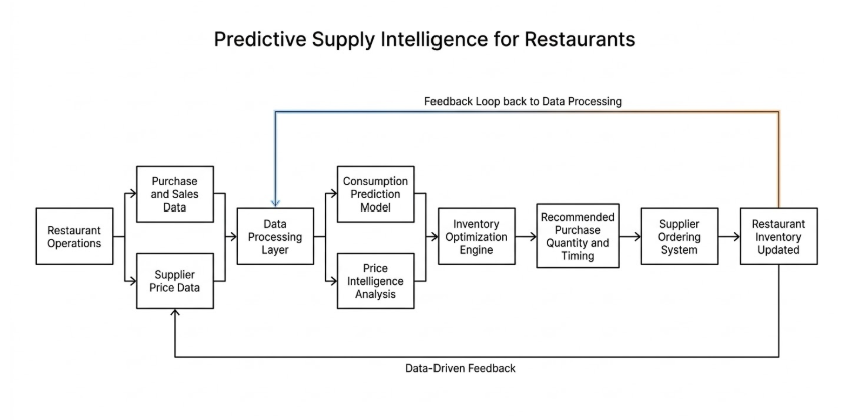

# ARPO

**Predictive supply chain intelligence for India's food industry.**

ARPO predicts when restaurants and food distributors should reorder raw materials, how much to buy, and at what price - using real billing data, commodity price trends, and demand signals.

---

## System Architecture

---

## The Problem

Restaurants in India buy raw materials on gut feel. No data, no forecasting, no price intelligence. Suppliers don't know real demand. Everyone is guessing — and it costs them money every day.

---

## What Arpo Does

- **Consumption prediction** - forecasts when a restaurant will run out of a raw material based on historical order cycles
- **Price intelligence** - tracks commodity price trends to identify the optimal time to buy
- **Reorder recommendations** - tells you what to order, how much, and when
- **Supply chain traceability** - every transaction is logged and traceable across the chain

---

## Current State

- Data pipeline: parses raw Tally ERP exports using pdfplumber and pandas
- Consumption model: predicts next reorder date per customer from historical cycles
- Dataset: real transaction data from a wholesale oil distribution business in Bangalore (Kamadhenu Enterprises)
- Identified precise ordering cycles across 32 named customers

---

## Stack

- Python, pandas, pdfplumber, scikit-learn, statsmodels
- Jupyter notebooks
- Data source: Tally ERP exports

---

## Roadmap

- [ ] Validate predictions against real orders
- [ ] Add seasonality and festival factors
- [ ] Price intelligence layer via Agmarknet API
- [ ] WhatsApp alert delivery via Twilio
- [ ] Billing software MVP
- [ ] Expand to wholesaler and manufacturer nodes

---

## Vision

Arpo's long-term goal is to become the intelligence layer connecting every node in India's food supply chain — from farmers to manufacturers to distributors to restaurants — where demand signals flow upstream in real time.

---

*Built by Sanjit Ramesh Kavitha*
